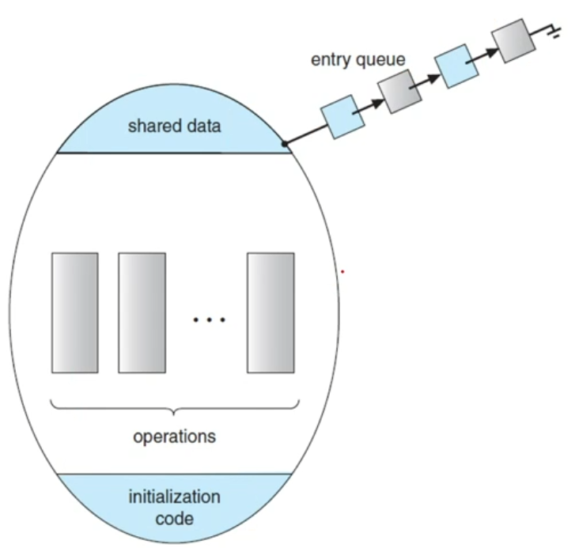
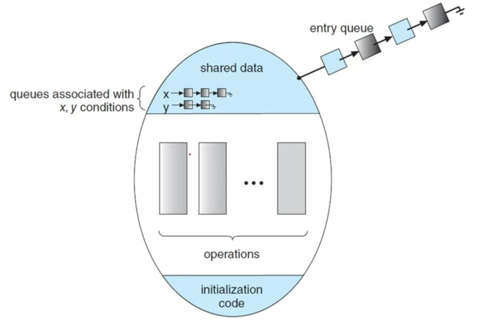

# 뮤텍스와 세마포어
- 뮤텍스(Mutex Locks)

	동기화를 위한 가장 간단한 도구입니다.

- 세마포어(Semaphore)

	뮤텍스보다 강력하고 편리하며 효과적인 도구입니다.

- 모니터(Monitor)

	뮤텍스와 세마포어의 문제를 개선한 도구입니다.

- 라이브니스(Liveness)

	프로세스가 진행되도록 보장합니다. 위의 도구들이 상호배제 문제만 해결주었다면 라이브니스는 데드락 문제도 해결해줍니다.

# 뮤텍스(Mutex Lock)
- mutex(`Mut`ral `ex`clusion) -> 상호배제를 구현하는 도구
- 임계영역을 보호해주고 경쟁상황이 발생하는 것을 막아줍니다.
- 프로세스는 임계영역에 들어가기 전에 lock을 겁니다. (acquire lock)
- 임계영역에 벗어나면 lock을 해제합니다. (release lock)

### 뮤텍스의 구현
acquire()로 lock을 걸고 releases()로 lock을 해제합니다.

avaliable : 잠금 상태를 확인하는 boolean 변수를 사용합니다.
```
while (true) {
	acquire lock
		critical section
	releases lock
		remainder section
}
```
- acquire() 구현
```
acquire() {
	while (!available)
		; /* busy wait */
	available = false;
}
```

- releases() 구현
```
 releases() {
	 available = true;
 }
```

acquire() 와 releases()는 원자적으로 구현되어야 합니다. (원자적이지 않으면 context switch가 일어나면서 값이 이상하게 나올 수 있음)

compare_and_swap 방식으로 구현할 수 있습니다.

## busy waiting 방식

- 어떤 프로세스가 임계영역에 진입하기 위해 계속해서 acquire()를 호출합니다.
- busy wating 방식은 계속해서 루프를 돌며 기다리기 때문에 멀티프로그래밍 환경에서 CPU 처리시간을 낭비하게 됩니다.

# Spinlock
- busy waiting을 사용하는 mutex lock을 Spinlock이라고 합니다.
- 사용가능한 상태가 될때까지 계속해서 프로세스를 회전합니다.
- busy wating 상태로 대기하다가 권한을 얻는 순간 바로 작업이 수행할 수 있기 때문에 context switch를 하면서 소모되는 시간이 줄어들지만 CPU를 선점하는 동안 사실상 아무 동작을 하고 있지 않는 것이기 때문에 시간을 낭비하게 됩니다.

# Semaphore(세마포어)
- 공유된 자원의 데이터 혹은 임계영역 등에 프로세스나 스레드를 나타내는 값을 두어서 상호배제를 구현할 수 있습니다.

## 세마포어의 구현
세마포어는 두 가지 원자연산을 통해서만 접근할 수 있는 정수 변수입니다.

wait(), signal() or P() V()로 표현합니다.

``` C++
wait(s) {
	while (s <= 0);
}
s--;

signal(s) {
	s++;
}
```

## 세마포어의 종류
- Binary Semaphore(이진 세마포어)

	세마포어의 값으로 0또는 1을 가집니다. 뮤텍스와 비슷한 방식입니다.

- counting semaphore

	초기값은 할당가능한 자원의 수로 정해지며, 세마포어의 값의 범위는 정해져 있지 않습니다.

### 카운팅 세마포어
- 할당가능한 자원수로 세마포어 변수를 초기화합니다.
- 프로세스가 자원을 사용하려고 하면 wait()을 호출하여 값을 1 감소시킵니다.
- 프로세스가 자원을 다 사용하면 signal()을 호출하여 값을 다시 증가시킵니다.

``` c++
typedef struct {
	int value;
	struct process *list;
} semaphore;

wait(semaphore *s) {
	s->value--;
	if (s->value < 0) {
		add this process to s->list
		sleep();
	}
}

signal(semaphore *s) {
	s->value++;
	if (s->value <= 0) {
		remove a process P from S->list;
		wakeup(P);
	}
}
```

## 세마포어 사용의 어려움

세마포어는 동기화에 편리하고 효과적인 방법이지만 특정 시퀀스가 발생하는 경우 타이밍 오류가 발생할 수 있습니다.

특정 시퀀스는 항상 일어나지도 않고 잡기도 어렵습니다.

예를 들어 이진 세마포어에서 wait()후 signal()을 지키지 않으면 임계영역에 두개의 프로세스가 들어가서 문제가 생길 수 있습니다.

``` c++
signal(mutex);
	critical section
wait(mutex);
```

```c++
wait(mutex);
	critical section
wait(mutex);
```

세마포어와 뮤텍스 같은 경우 실수가 발생할 위험이 커서 이 실수를 줄이고자 `monitor` 라는 방법을 사용하게 됩니다.

# monitor(모니터)

모니터 타입은 상호 배제를 하기 위한 하나의 타입입니다. 자바의 경우 클래스라고 생각하면 됩니다.

``` 
monitor monitor name

function P1(...) {
	// code
}

function P2(...) {
	// code
}

function Pn(...) {
	// code
}

init_code(...) {
	// code
}
```

- 모니터는 다음과 같은 흐름을 가집니다.

	

## condition value

모니터 자체로는 프로세스 동기화를 모델링하기에 충분하지 않기 때문에 condition value 를 선언하여 추가해줍니다.

컨디션 변수는 어떤 실행을 상태가 원하는 것과 다를 때 조건이 참이 되기를 기다립니다.

```
condition x, y;
x.wait();
x.signal();
y.wait();
y.signal()
```



## java monitor

java는 스레드 동기화를 위해 모니터와 같은 것을 제공합니다.

모니터 락이라고 불립니다.

자바에서 동기화 하기 위해서는 `synchronized` 키워드와 `wait()` `notify` 메서드를 알고 있으면 됩니다.

### syncronized keyword

임계영역에 해당하는 코드 블록을 선언할 때 사용하는 자바 키워드입니다.

해당 코드 블록(임계영역)에는 모니터락을 획득해야 진입 가능합니다.

모니터락을 가진 객체 인스턴스를 지정할 수 있습니다.

메서드에 선언하면 메서드 코드 블록 전체가 임계영역으로 지정됨

이 때, 모니터락을 가진 객체 인스턴스는 this 객체 인스턴스입니다.

``` java
synchronized (object) {
	// critical section
}

public syncronized void add() {
	// critical section
}
```

### wait() and notify() 메서드

java.lang.Object 클래스에 선언된 모든 자바 객체가 가지고 있는 메서드입니다.

쓰레드가 어떤 객체의 wait() 메서드를 호출하면 해당 객체의 모니터락을 획득하기 위해 대기 상태로 진입합니다.

쓰레드가 어떤 객체의 notify() 메서드를 호출하면 해당 객체 모니터에 대기 중인 쓰레드 하나를 깨웁니다.

notify() 대신에 notifyAll() 메서드를 호출하면 해당 객체 모니터에 대기중인 쓰레드 전부를 깨웁니다.

# Liveness

임계영역에 대한 해결방안으로 알아본 뮤텍스, 세마포어, 모니터는 상호배제만 해결이 가능합니다.

Liveness(라이브니스)는 진행(Progress), 한정대기(bounded-waiting)문제를 해결할 수 있습니다.

## deadlock

두 개 이상의 프로세스가 서로 상대방의 작업이 끝나기 만을 기다리고 있기 때문에 무한 대기에 빠지는 상황을 말합니다.

## Priority Inversion

높은 우선순위를 가지는 프로세스가 낮은 우선순위를 가진 프로세스보다 늦게 실행되는 현상입니다.

예를들어, 프로세스 3개가 존재하고 `P1 > P2 > P3`와 같은 우선순위를 가지고 있다고 할때, P1과 P3는 실행시 공유자원에 접근을 해야되고 P2는 공유자원에 접근하지 않는다고 합시다.

가장 먼저 P3가 실행된다고 하면 공유자원 접근을 위해 lock을 획득하고 다른 프로세스 이 자원에 접근할 수 없게됩니다.

이 때 P1이 공유자원의 접근이 필요해지면 lock을 획득해야 하는데 이미 P3가 점유하고 있으므로 대기 하게 됩니다.

이 때 공유자원이 필요없는 P2가 실행하려고 했을 때 P3보다 우선순위가 높기 때문에 P3를 대기시키고 P2가 실행됩니다.

P2의 작업이 완료되면 P3는 다시 작업을 시작하고 P3가 종료되면 P1이 실행됩니다.

이런식으로 우선순위가 역전되는 상황을 Priority Inversion(우선 순위 역전)이라고 합니다.
